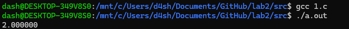
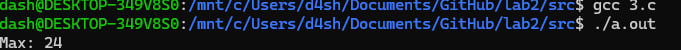
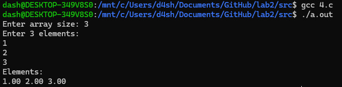
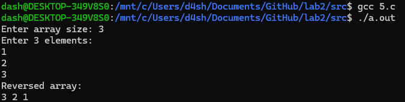
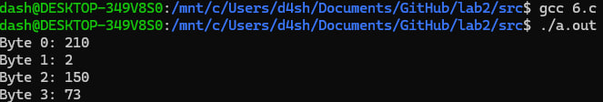
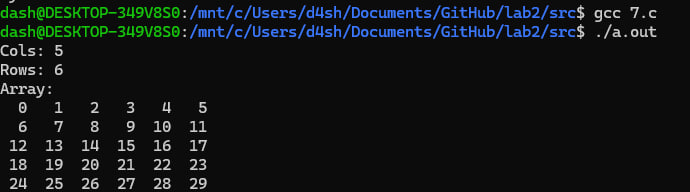

# Лабораторная работа 2 - Указатели, арифметика указателей
### Информация о студенте  
Шарманов Даниил Андреевич, 1 курс, ИВТ-1.1  
## 1.  
### Задача  
Внутри функции int main(void) { /*...*/ } определите указатель double ***pointer = NULL;. Инициализируйте этот указатель адресом другого указателя типа double **, который указывает на переменную
double *, которая указывает на double. Используйте pointer для записи и чтения значения 2.0 в сегмент
оперативной памяти для double.
### Математическая модель
--  
### Список идентификаторов
| Имя  | Тип | Смысл |
| --- | --- | --- |
| pointer  | double***  |  указатель |
| pp  | double**  |  указатель |
  
### Код программы
```C
#include <stdio.h>
#include <stdlib.h>

int main(void) {
    double*** pointer = NULL; double** pp = malloc(sizeof(double*)); *pp = malloc(sizeof(double)); **pp = 2.0; pointer = &pp; printf("%f\n", ***pointer); free(*pp); free(pp);
}
```
### Результат выполненной работы  
  

## 2.  
### Задача  
Сложение двух чисел:  
Напишите программу, которая складывает два числа с использованием указателей на эти числа.  
### Математическая модель
S = N1 + N2  
### Список идентификаторов
| Имя  | Тип | Смысл |
| --- | --- | --- |
| num1  | int  |  первое число |
| num2  | int  |  второе число |
| sum  | int  |  сумма чисел |
| p1  | int*  |  указатель на первое число |
| p2  | int*  |  указатель на второе число |  
  
### Код программы
```C
#include <stdio.h>

int main() {
    int num1 = 2;
    int num2 = 88;
    int* ptr1 = &num1, *ptr2 = &num2;
    int sum;
    sum = *ptr1 + *ptr2;

    printf("Sum: %d\n", sum);

    return 0;
}
```
### Результат выполненной работы  
  

## 3.  
### Задача  
Нахождение максимума из двух чисел:  
Напишите программу, которая находит максимальное число из двух чисел, используя указатели на эти числа.  
### Математическая модель
--  
### Список идентификаторов
| Имя  | Тип | Смысл |
| --- | --- | --- |
| a  | int  |  первое число |
| b  | int  |  второе число |
| max  | int  |  максимальное число |
| ptr1  | int*  |  указатель на первое число |
| ptr2  | int*  |  указатель на второе число |  

### Код программы
```C
#include <stdio.h>

int main() {
    int a = 13;
    int b = 24;
    int* ptr1 = &a, * ptr2 = &b;
    int max = (*ptr1 > *ptr2) ? *ptr1 : *ptr2;
    printf("Max: %d\n", max);

    return 0;
}
```
### Результат выполненной работы  
  

## 4.  
### Задача  
Динамический массив с плавающей точкой:  
Напишите программу, которая создаёт одномерный динамический массив из чисел с плавающей точкой двойной точности, заполняет его значениями с клавиатуры и распечатывает все элементы этого массива, используя
арифметику указателей (оператор +), а не оператор доступа к элементу массива []  
### Математическая модель
--  
### Список идентификаторов
| Имя  | Тип | Смысл |
| --- | --- | --- |
| size  | int  |  размер массива |
| array  | double*  | динамический массив |
| ptr  | double*  |  указатель на элемент массива |
  
### Код программы
```C
#include <stdio.h>
#include <stdlib.h>

int main() {
    int size;
    double* array;

    printf("Enter array size: ");
    scanf("%d", &size);

    array = (double*)malloc(size * sizeof(double));
    printf("Enter %d elements:\n", size);
    for (double* ptr = array; ptr < array + size; ptr++) {
        scanf("%lf", ptr);
    }
    printf("Elements:\n");
    for (double* ptr = array; ptr < array + size; ptr++) {
        printf("%.2f ", *ptr);
    }
    printf("\n");
    free(array);

    return 0;
}
```
### Результат выполненной работы  
  

## 5.  
### Задача  
Обратный порядок элементов массива:  
Выведите элементы динамического массива целых чисел в обратном порядке, используя указатель и операцию
декремента (--).  
### Математическая модель
--  
### Список идентификаторов
| Имя  | Тип | Смысл |
| --- | --- | --- |
| size  | int  |  размер массива |
| array  | int*  | динамический массив |
| ptr  | int*  |  указатель на элемент массива |  
  
### Код программы
```C
#include <stdio.h>
#include <stdlib.h>

int main() {
    int size;
    int* array;

    printf("Enter array size: ");
    scanf("%d", &size);

    array = (int*)malloc(size * sizeof(int));
    printf("Enter %d elements:\n", size);
    for (int* ptr = array; ptr < array + size; ptr++) {
        scanf("%d", ptr);
    }

    printf("Reversed array:\n");
    for (int* ptr = array + size - 1; ptr >= array; ptr--) {
        printf("%d ", *ptr);
    }
    printf("\n");
    free(array);

    return 0;
}
```
### Результат выполненной работы  
 
  
## 6.  
### Задача  
Побайтовый вывод переменной:  
Определите переменную целого типа int a = 1234567890; и выведите побайтово её содержимое на экран,
используя указатель char *.  
### Математическая модель
--  
### Список идентификаторов
| Имя  | Тип | Смысл |
| --- | --- | --- |
| a  | int  |  число |
| ptr  | char*  | динамический массив по 4 байта |  

### Код программы
```C
#include <stdio.h>

int main(void) {
    int a = 1234567890;
    char* ptr = (char*)&a;
    for (int i = 0; i < sizeof(int); i++) {
        printf("Byte %d: %d\n", i, (unsigned char)ptr[i]);
    }
    return 0;
}
```
### Результат выполненной работы  
 

## 7.  
### Задача  
Двумерный динамический массив:  
Выделите память под двумерный динамический массив, используя массив указателей на строки (см. лекции), и
затем корректно освободите оперативную память  
### Математическая модель
--  
### Список идентификаторов
| Имя  | Тип | Смысл |
| --- | --- | --- |
| rows  | int  |  количество строк массива |  
| rows  | int  |  количество колонок массива |  
| array  | int**  |  двумерный массив |  
| i  | int  |  индекс |  
| j  | int  |  индекс |  
### Код программы
```C
#include <stdio.h>
#include <stdlib.h>

int main() {
    int rows, cols;
    int** array;

    printf("Cols: ");
    scanf("%d", &rows);
    printf("Rows: ");
    scanf("%d", &cols);

    array = (int**)malloc(rows * sizeof(int*));

    for (int i = 0; i < rows; i++) {
        array[i] = (int*)malloc(cols * sizeof(int));
    }

    printf("Array:\n");
    for (int i = 0; i < rows; i++) {
        for (int j = 0; j < cols; j++) {
            array[i][j] = i * cols + j;
            printf("%3d ", array[i][j]);
        }
        printf("\n");
    }

    for (int i = 0; i < rows; i++) {
        free(array[i]);
    }
    free(array);

    return 0;
}
```
### Результат выполненной работы  
 
